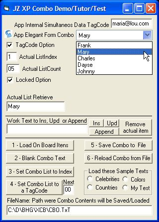



## JZ XP Combo Box v1\.2

### Description

All-Win XP-style COMBO control, very easy and objective (programmer and user). More: Save/Load to Text File, runtime Append, Ins, Upd, Remove items. You can associate a TagCode to entries, as Data Codes, Tags, etc, can act as easy small data table without DB Engines.

Project with a Demo/Tutor/Test form.

I've made a HTML and a .Doc Control Guide.

1.2 version: new GetItem function, some events and design fixes.
 
### More Info
 
Project with a Demo/Tutor/Test form.

I've made a HTML and a .Doc Control Guide.

             |
---                |---
**Submitted On**   |2005-05-16 19:32:20
**By**             |[JOZE Walter Moura](https://github.com/Planet-Source-Code/PSCIndex/blob/master/ByAuthor/joze-walter-moura.md)
**Level**          |Intermediate
**User Rating**    |5.0 (10 globes from 2 users)
**Compatibility**  |VB 6\.0
**Category**       |[Custom Controls/ Forms/  Menus](https://github.com/Planet-Source-Code/PSCIndex/blob/master/ByCategory/custom-controls-forms-menus__1-4.md)
**World**          |[Visual Basic](https://github.com/Planet-Source-Code/PSCIndex/blob/master/ByWorld/visual-basic.md)
**Archive File**   |[JZ\_XP\_Comb1888845162005\.ZIP](https://github.com/Planet-Source-Code/joze-walter-moura-jz-xp-combo-box-v1-2__1-60511/archive/master.zip)

